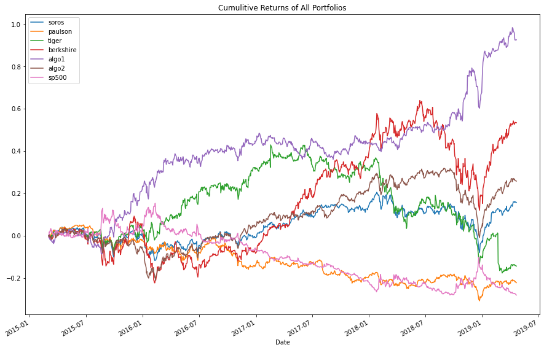
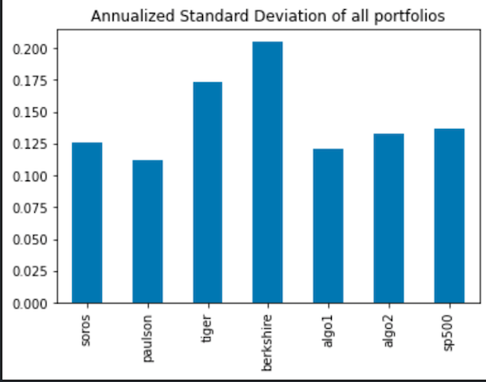
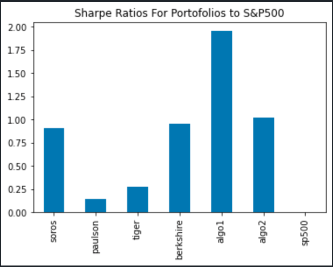

# Portfolio-Analysis

## Summary 

This Python tool will be able to analyze and visualize investment portfolio data for comparing return on investments performances.

## Process and Metrics Analysis

- Data Cleaning :
The data cleaning was done on csv files in the resources folder with the following steps:
    - Remove missing values
    - Remove duplicates 
    - Check data types and convert to correct data types when necessary

- Conducting Quantitative Analysis :
Cumulative returns were calculated for the portfolios to measure the performance of the portfolios visually.

- Risk Analysis :
 A chart was created to visualize the risk of the portfolios and help determine which portfolio is the best by using a standard deviation of the returns.
 we clearly see that both Algo1 and Paulson have the lower risks.

 

 - Sharpe Ratio :
The Sharpe ratio was calculated to determine which portfolio was better compared to the overall market performance.

## How to use this tool
- simply load any stock data in csv file format in the resources folder having 2 columns:
date and price. and run the create custom portfolio section.